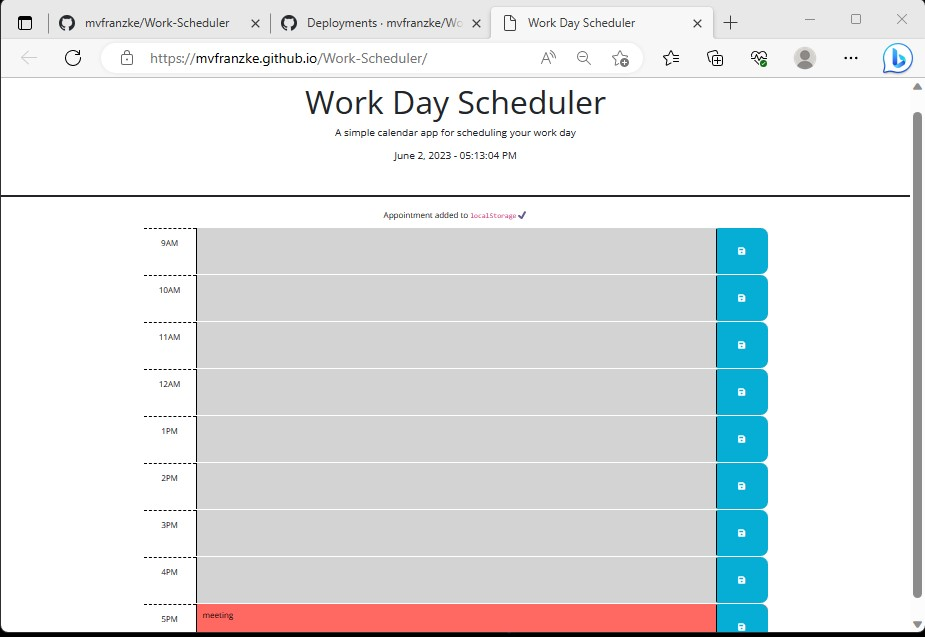

# Module-5-Challenge (Work Day Scheduler)
## Description
This is the fifth assignment or challenge for our bootcamp class. In this assignment we're given a starter code and have to create a calendar application that allows user to save their schedule from 9am to 5pm. 

## Installation
N/A

## Usage
URL of deployed application : https://mvfranzke.github.io/Work-Scheduler/

URL of Github repository : https://github.com/mvfranzke/Work-Scheduler

Screenshot of deployed application can be found here: 

## Credits
I used the following as additional resources when creating the webpage:

https://www.w3schools.com/ 

https://stackoverflow.com/

## License
N/A
